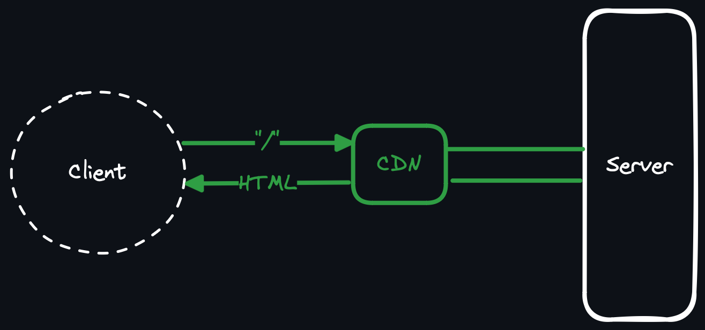
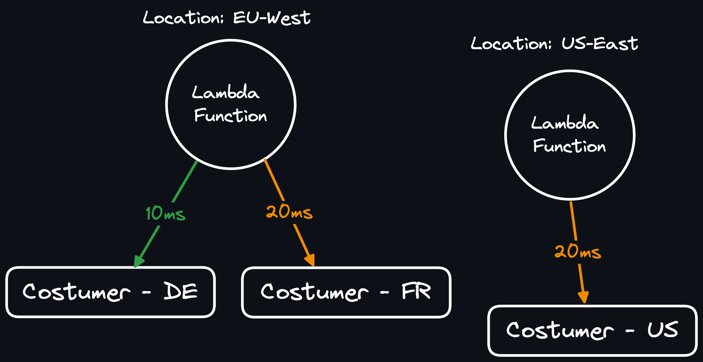
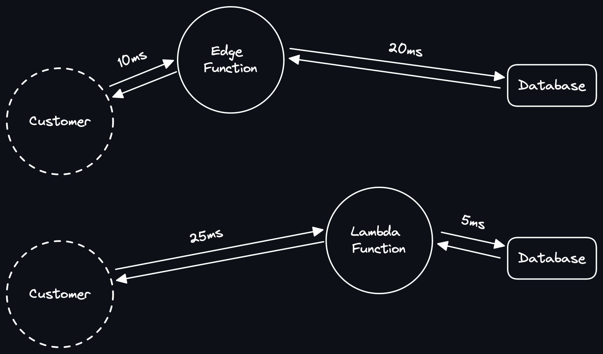
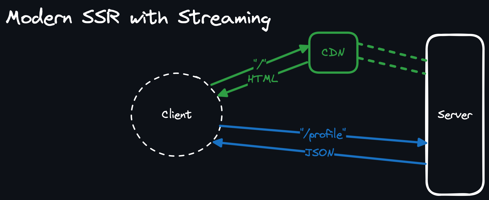

> [!NOTE]
> Keep in mind the following paper is in the Draft stage

# Front-end Overview

## Abstarct
User experience can be altered based on many factors, such as website design, performance, user-friendliness and many more. Users can tolerate bad design or unfriendly interfaces, but if operating every single action takes up to a couple of seconds, users will most likely leave the website. In this paper, we are going to look into just a part of a website's performance, mainly on the different front-end libraries and their effect on the website. Since Libraries such as React JS and Angular were released many years ago, they had to keep many legacy features such as the virtual DOM, which led them to be much slower than newer solutions such as Solid JS, which doesn’t use such methods. Another drawback of those legacy libraries is the fact that their server-side rendering is astonishingly slow, leading them to render half of the pages which Solid JS can render. But since we are dealing with JavaScript running on the server, the performance can be a deal breaker for many use cases, which leads us to partially render the Web Pages on the website, meaning we don’t render the HTML page on the website, but we embed the needed data for front-end library inside the page, and let it to generate the page on the client, although this method might lead to higher TTI and FCP, it's a must when we can’t handle that many requests. Such a method is used by YouTube to handle their web pages.

## Intorduction
Web Developers must guarantee a great experience for users, meaning the lack of performance hints at problems regarding the Architecture of the website and its inner workings. The Front-end web developer can’t do anything in case the database takes a long time to process a query, but they can add loading indicators, or element skeletons to somewhat, improve the perceived performance of the website. In most cases, it's preferable for a loading indicator, instead of waiting on a blank screen of nothing, until the server renders the HTML page. On the other hand, creating a performant front-end is the sole responsibility of the front-end developer.  In this paper, we are going over why and how we transitioned from server-side rendered web pages, to single page apps, and back again to the server-side rendering, how to scale our rendering frameworks, and what are the solutions if JavaScript can’t handle our performance needs.  

## Traditional MPA
Most of the “Traditional MPA” websites are server-side rendered, meaning each page of the website is rendered to HTML per each request and then sent down to the client. The problem is quite obvious, but let’s point couple of them here:
Even minor updates might lead to the full rendering and downloading of the entire HTML page.
Route changes take much longer, in cases where the user connection is spotty.
Since the server needs to render each page, it will lead to a very heavy load on the web server.
Personalized pages, such as dashboards need to be customized for each user, meaning there is no possibility of caching.
These problems led us to the next generation of websites/web applications, the “Single Page Application - SPA” area.

Example of Traditional Server-Side Rendering for an MPA

## SPA

### Introduction
Unlike MPAs, SPA doesn't include any server-side rendering. The Client loads an empty HTML page with the SPA as a JavaScript file, then the JavaScript will generate the page and keep it updated by fetching additional data or manipulating the webpage based on the user's input.

Example of SPA Initial Load

### SPA vs Traditional MPA
Single-page applications solved many problems of “Traditional Webpages”. Since every user needed to download the same files, they could be easily cached on a CDN, and any additional data, such as user data would be loaded after the page was generated by the client-side library. This sort of web application has been categorized as JAM Stack ( JavaScript, API, Markup ).

### Popular Front-end Libraries
Over the years, there have been many Front-end libraries, since comparing all of them would be impossible, we will focus on the following libraries:
Angular: Developed by Google as a fully featured Front-end Framework with peer libraries to ensure a reliable web experience.
  - React JS: Developed by Facebook as a small library for managing the state of components.
  - Preact: Developed as a faster and lighter replacement for React JS, with a similar API. 
  - Solid JS: Founded by “Ryan Carniato” with “fine-grained reactive” in mind, which leads to the best possible performance.
Here is an overview of the mentioned libraries and some of their differences

| Name     | DOM Manipulation Method | Includes VDOM | Release Date | Github Stars * |
| -------- | ----------------------- | ------------- | ------------ | -------------- |
| Angular  | Diffing with Runtime     | Yes           | 2010         | 92K            |
| React JS | Diffing with Runtime     | Yes           | 2013         | 216K           |
| Preact   | Diffing with Runtime     | Yes           | 2015         | 35K            |
| Solid JS | Surgical DOM updates    | No            | 2018         | 29K            |

\* Github Stars are counted as of November of 2023

### Performance Benchmarking
The following performance results are extracted from “JS Framework Benchmark” which is one of the Gold-Standard JavaScript benchmarks, concerned with Front-end libraries.

|         | Select Row | Swap Rows |	Partial Update |
| ------  | ---------- | --------- |	-------------- |
| Vanilla |	3.1        | 23.5      |	20.2           |
| Solid   |	3.9        | 24.9      |	20             |
| Angular |	4.5        | 25.4      |	21.6           |
| Preact  |	16.8       | 38.8      |	21.2           |
| React   |	6.4        | 161       |	26             |

Performance of Selected Operation in mentioned libraries in MS - Lower is better

The Operations are as listed below: 
  - Partial Update: updating every 10th row for 1,000 rows (3 warm-up runs). 4 x CPU slowdown.
  - Select Row: highlighting a selected row. (5 warm-up runs). 4 x CPU slowdown.
  - Swap Rows: swap 2 rows for a table with 1,000 rows. (5 warm-up runs). 4 x CPU slowdown.
You can find more details regarding this benchmark on their website. As you can see on the charts, the manipulation performance is almost on the same level, and you won’t notice them unless you have a very complex application. But DOM manipulation isn’t the only important metric for front-end libraries. Startup time is much more crucial for many web applications. In most cases, if the JavaScript bundle is too large, it will lead to a higher TTI and TBT. TBT is one of the most important web metrics.

> [!TIP]
> “ Total Blocking Time (TBT) is an important lab metric for measuring load responsiveness because it helps quantify the severity of how non-interactive a page is prior to it becoming reliably interactive—a low TBT helps ensure that the page is usable. ” Total Blocking Time (TBT) Article on web.dev

|         | Size ( KB )	| TTI ( MS ) |
| ------- | -----------	| ---------- |
| Preact  |	152.3	      | 1,877      |
| Vanilla |	149.7	      | 1,876      |
| Solid   |	150	        | 1,876      |
| React   |	280.5	      | 2,477      |
| Angular |	276.2	      | 2,628      |

Lower is better

Since “Preact” and “Solid” ship the smallest client-side bundle they lead the charts and have the same performance as vanilla JavaScript. But React and Angular are Shipping a much larger bundle which will lead to the higher TTI and TBT. Keep in mind that in case the client network is slow, it will cause a much higher TTI which is quite undesirable. 

### Drawbacks of SPA applications
Since we are shipping an almost blank HTML page from the server, it will cause the crawlers to misunderstand our pages. Another deal-breaking problem with the SPA applications is for applications such as online shops, which need to show their products as fast as possible. Imagine if a user opens a web page and has to wait for a couple of seconds just to see the product. This limitation led to the development of a new generation of backend frameworks. Unlike most backend frameworks, these were written in JavaScript, to facilitate the server-side rendering of front-end libraries. 

## Rendering Frameworks
Rendering Frameworks will facilitate the rendering of client-side libraries, here are a couple of them which we will focus on in this paper:
  - Next JS: Designed by Vercel to help with rendering React JS on the server. The most popular solution for server-side rendering React Components, and the preferred server-side rendering method by the React team.
  - Angular: Since Angular is a fully featured framework - unlike React JS - it has a built-in feature for server-side rendering which we will use for this comparison.
  - Astro: A library-agnostic framework designed to support all of the popular front-end libraries. I used it as a baseline benchmarking tool to strip out all of the framework-specific results and focus on the library’s server-side rendering performance.
  - Solid Start: The in-house method of server-side rendering by the Solid JS team.

### The “BuilderIO Team” benchmark
Unfortunately, there aren’t that many well-designed-server-side-rendering benchmarks for Rendering frameworks, and the “BuilderIO’s team” is somewhat out of date. Since there weren't that many changes in our selected frameworks, the results are still relevant.

| Name         | 1%   | 99%    |
| ------------ | ---- | ------ |
| Solid Start  | 534  | 1019   |
| Astro        | 641  | 444    |
| Next JS      | 142  | 233    |
| Angular      | 45   | 76     |

### My benchmark
Since there weren’t that many benchmarks I created my own which uses the latest releases of each framework as of November of 2023. The server needs to render a large number of elements in a list and return the rendered page to the client, then the client-side code will hydrate the page. The following results have been recorded from a VDS with the following spec: 2-core CPU with 4 threads ( at 2.1GHz  ) and 16g of RAM, running node version 21. A guide on how to run the benchmark is available on GitHub.

| Name                               | Min  | Median | 97.5%  |
| ---------------------------------- | ---- | ------ | ------ |
| [Solid Start](./ssr/solid-ssr/)    | 65   | 177    | 225    |
| [Angular](./ssr/angular-ssr/)      | 38   | 132    | 167    |
| [Astro + Solid](./ssr/astro-ssr/)  | 41   | 106    | 118    |
| [Astro + React](./ssr/astro-ssr/)  | 52   | 79     | 107    |
| [Astro + Preact](./ssr/astro-ssr/) | 24   | 71     | 80     |
| [Next JS](./ssr/next-ssr/)*        | 1    | 28     | 105    |

SSR Performance of Selected Frameworks on a “2 Core VDS” - Higher is better
\* Next JS Failed to handle 50 connections so it was throttled down to 10

### Further performance improvements
By default, every component is hydrated after initial loading on the client, but most of the mentioned frameworks support “Partial Hydration”, meaning we can choose which components need to be hydrated and which of them don’t need. In this way, we can decrease the JavaScript bundle size and decrease the TTI and TBT. Here is an example of how it would look like.

Imagine that we only have some sort of interaction in the navbar and the sidebar, meaning all of the rest of the components are static. Well, in this case, we only hydrate the interactive components and we can save a significant amount of client-side code.

### Drawbacks of Rendering Frameworks
As you can see on the last page’s chart, since we are running JavaScript on the server, the performance is not satisfactory. We can try to solve it with many methods, ranging from using SSG / ISR rendering methods, Lambda or Edge Functions, or in some specific cases, instead of fully rendering the pages, rendering them partially, we will go over each of the mentioned methods in the next sections.

## Solving the performance problems

### SSG and or ISR
SSG or Server-Side-Generation lets you only render your pages once and then host them everywhere as static HTML pages. Imagine you have a blog, since most of the content will be static, you can skip the server-side rendering on each request and instead only render the website once there is a new blog, therefore you can cache all of the content and serve them over a CDN, which will increase your loading speeds. It also enables you to use a static hosting service such as Cloudflare Pages. 
The other method is using ISR - Incremental Static Regeneration. There are many times when hosting the latest data isn’t absolutely crucial. Imagine a website which displays the menu of a restaurant or a cafe, they will only modify their items once in a while. With ISR you can try to regenerate that page at a certain interval or notify your backend when there are some changes which will trigger to re-render that page.
Both methods are quite easy to pair with a CDN, which will be absolutely crucial when websites are hosted from a monolith server.

Example data flow of an ISR / SSG website

### Lambda Functions - Serverless
Almost all of the mentioned libraries support being hosted with a lambda function, in case you aren't familiar with them I suggest you read about them before continuing, but in short they are Isolated NodeJS instances which will scale with your requests. Due to their nature, your servers will be distributed by default and there won’t be a single point of failure. But for the best performance, you also have to use a distributed database such as Cloudflare D1 or Turso’s SQLite. Since Lambda functions are a managed service, they are generally more expensive than running your applications on a VPS / VDS. That being said, for most startups, Serverless Functions are much easier to scale and maintain. Since Lambda Functions are distributed they will reduce the delay between your customers and server response which is great for services with an international customer base.

Example of estimated delay between Lambda Functions and Customers

### Edge Functions
Like Lambda functions, Edge functions are isolated instances which run your JavaScript code with some major differences. Unlike Lambda Functions, Edge Functions have a limited runtime, and many of the Node JS APIs aren’t available in them. These runtime reductions help Edge Functions to be much cheaper and faster. Another big difference between them is that the Edge Functions are much closer to the user, since they need much fewer resources, they are much easier to replicate. The only limiting factor is the problem of IO latency, if your web application is IO bound - meaning they need to make many database queries -  their performance will suffer when running on the Edge. Distributed Databases might help them to scale, but it’s generally faster to render them with lambdas which are closer to your database.

Estimated delay between Runtimes and the database

### HTML Streaming
Another relatively new method of scaling web applications - at least for JavaScript Frameworks - is the addition of HTML streaming. Next JS team is working on this feature under the “Preview” flag, you can read more about it on their release page of Next JS 14 here*. With this method we can cache the static part of our website - such as the navbar, footer, and sidebar… - and then generate and stream the rest of the content when the user visits the page. Since the user’s connection to the HTML page starts much sooner, the browser starts loading blocking assets such as CSS and JavaScript which leads to a much faster page loading speed. All of that being said, as of this moment, there aren’t that many CDN solutions for this method of rendering, which means we have to put the full load of our website on our server, which isn’t desirable.

Data flow of a streamed HTML page behind a CDN

### Partial Server Side Rendering
If all the previous methods couldn’t solve our problems, we have to start to ditch the server-side rendering and look into Partial Server-Side Rendering. Unlike SSR, we don’t render the HTML on the server, but instead, we will embed the needed data on our HTML page, think of it as a way to eliminate the first API request of a JAM Stack webpage. Since the client-side library has access to the needed data, it can start rendering the DOM after all the JavaScript content has been loaded. Although this method might lead to a slight degradation of TBT and FCP, it will reduce our server load by an astonishing amount. Currently, YouTube uses such a method to handle its Web Pages. I tried to create an example of PSSR with a combination of a Solid JS client-side application and a Golang back-end, please keep in mind I am quite new to Golang, and since I haven't used a back-end library with my solution it had a much leaner source code compared to most of JavaScript Frameworks - meaning if you use a Golang back-end framework, your results might be less performant. After putting the results of this method and comparing it with JavaScript frameworks, it's almost 10x faster than the fastest one - which was Solid JS. You can find the source code of this project under the “pssr” directory on GitHub.

| Name                               | Min  | Median | 97.5%  |
| ---------------------------------- | ---- | ------ | ------ |
| [PSSR - Solid + GO](./pssr/)       | 2127 | 2446   | 2581   |
| [Solid Start](./ssr/solid-ssr/)    | 65   | 177    | 225    |
| [Angular](./ssr/angular-ssr/)      | 38   | 132    | 167    |
| [Astro + Solid](./ssr/astro-ssr/)  | 41   | 106    | 118    |
| [Astro + React](./ssr/astro-ssr/)  | 52   | 79     | 107    |
| [Astro + Preact](./ssr/astro-ssr/) | 24   | 71     | 80     |
| [Next JS](./ssr/next-ssr/)*        | 1    | 28     | 105    |

SSR Performance of Selected Frameworks on a “2 Core VDS” - Higher is better
\* Next JS Failed to handle 50 connections so it was throttled down to 10

## Conclusion
In Conclusion, there are many ways to scale your JavaScript Web Apps, but almost all of them have some trade-offs. You might check if you can use strategies such as ISR or SSG. In case they weren’t possible you might have to look into serverless deployment strategies with Lambda Functions or Edge Functions. But there is a point in which the cost of those services goes through the roof, at that moment you might have to look into other options such as Partial-Server-Side-Rendering to alleviate your server load, but keep in mind using solutions such as paring a client-side library with a back-end framework in Golang means the development team have to manage an application in two languages which will undoubtedly increase the complexity of development and deploying of the web application.
